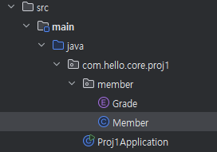
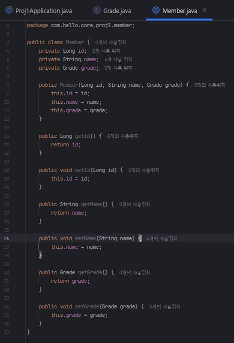
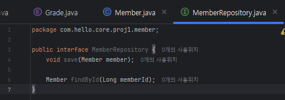
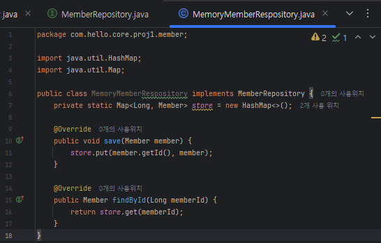
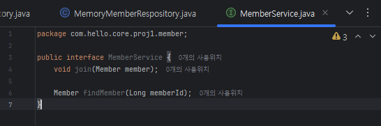
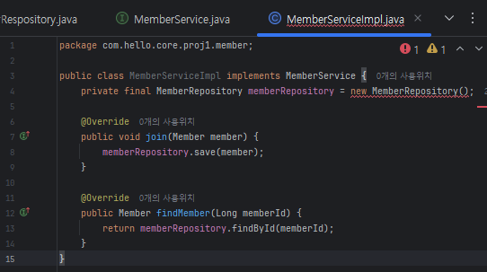
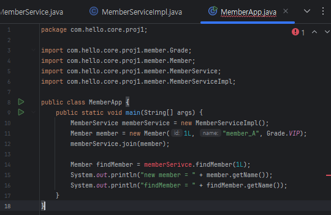
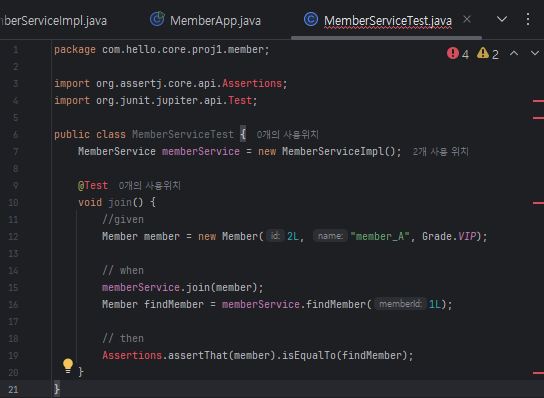

# 회원 도메인과 할인 정책 그리고 새로운 할인 정책 개발 


## 회원 도메인 요구사항
- 회원을 가입하고 조회할 수 있다.
- 회원은 일반과 VIP 두 가지 등급이 있다.
- 회원 데이터는 자체 DB를 구축할 수 있고, 외부 시스템과 연동할 수 있다. (미확정)

### 


### Grade.Java
- 회원 등급(Grade) 도메인 모델
- 회원이 일반(BASIC)인지, VIP 인지 구분하기 위한 열거형 코드
```
package com.hello.core.proj1;

public enum Grade {
    BASIC,
    VIP
}
```


### Member.Java
- 회원 객체를 표현하는 클래스 (도메인 모델)
- id, name, grade(등급) 필드를 가짐
- 회원 정보 저장, 조회 시 사용되는 핵심 데이터 구조

```
package com.hello.core.proj1.member;

public class Member {
    private Long id;
    private String name;
    private Grade grade;

    public Member(Long id, String name, Grade grade) {
        this.id = id;
        this.name = name;
        this.grade = grade;
    }

    public Long getId() {
        return id;
    }

    public void setId(Long id) {
        this.id = id;
    }

    public String getName() {
        return name;
    }

    public void setName(String name) {
        this.name = name;
    }

    public Grade getGrade() {
        return grade;
    }

    public void setGrade(Grade grade) {
        this.grade = grade;
    }
}
```


### MemberRepository.Java
- 회원 저장소 역할을 정의한 인터페이스
- 회원을 저장(save)하고, id로 찾는(findById) 기능 제공
- 구현체를 바꿔 끼울 수 있도록 설계됨 (DB, 메모리, 외부 시스템 등)
```
package com.hello.core.proj1.member;

public interface MemberRepository {
    void save(Member member);

    Member findById(Long memberId);
}
```


### MemoryMemberRespository.Java
- MemberRepository의 구현체
- HashMap을 사용해서 메모리에 회원 정보 저장
```
package com.hello.core.proj1.member;

import java.util.HashMap;
import java.util.Map;

public class MemoryMemberRespository implements MemberRepository {
    private static Map<Long, Member> store = new HashMap<>();

    @Override
    public void save(Member member) {
        store.put(member.getId(), member);
    }

    @Override
    public Member findById(Long memberId) {
        return store.get(memberId);
    }
}
```


### MemberService.Java
- 회원 서비스 역할을 정의하는 인터페이스
- 회원 가입(join), 회원 조회(findMember) 기능 제공
- 비즈니스 로직 계층
```
package com.hello.core.proj1.member;

public interface MemberService {
    void join(Member member);

    Member findMember(Long memberId);
}
```


### MemberServiceImpl.Java
- MemberService의 구현체
- 실제 회원 가입, 조회를 MemberRespository에게 위임해서 처리
```
package com.hello.core.proj1.member;

public class MemberServiceImpl implements MemberService {
    private final MemberRepository memberRepository = new MemberRepository();
    
    @Override
    public void join(Member member) {
        memberRepository.save(member);
    }
    
    @Override
    public Member findMember(Long memberId) {
        return memberRepository.findById(memberId);
    }
}
```


### MemberApp.Java'
- 메인 애플리케이션 실행용 클래스
- 회원 객체를 생성하고, 가입 -> 조회 흐름을 테스트
- 콘솔 출력으로 결과 확인
```
package com.hello.core.proj1;

import com.hello.core.proj1.member.Grade;
import com.hello.core.proj1.member.Member;
import com.hello.core.proj1.member.MemberService;
import com.hello.core.proj1.member.MemberServiceImpl;

public class MemberApp {
    public static void main(String[] args) {
        MemberService memberService = new MemberServiceImpl();
        Member member = new Member(1L, "member_A", Grade.VIP);
        memberService.join(member);

        Member findMember = memberSerivce.findMember(1L);
        System.out.println("new member = " + member.getName());
        System.out.println("findMember = " + findMember.getName());
    }
}
```


### MemberServiceTest.Java
- JUnit 테스트 클래스
- join()을 테스트 -> 회원 가입한 뒤, 다시 조회했을 때 같은 객체가 나오는지 검증
- Assertions.asserThat()으로 테스트 결과 확인
```
package com.hello.core.proj1.member;

import org.assertj.core.api.Assertions;
import org.junit.jupiter.api.Test;

public class MemberServiceTest {
    MemberService memberService = new MemberServiceImpl();

    @Test
    void join() {
        //given
        Member member = new Member(2L, "member_A", Grade.VIP);

        // when
        memberService.join(member);
        Member findMember = memberService.findMember(1L);

        // then
        Assertions.assertThat(member).isEqualTo(findMember);
    }
}
```


## 주문과 할인 정책
## 주문과 할인 정책 요구사항
- 회원은 상품을 주문할 수 있다.
- 회원 등급에 따라 할인 정책을 적용할 수 있다.
- 할인 정책은 모든 VIP는 1,000원을 할인해주는 고정 금액 할인을 적용해달라. (나중에 변경될 수 있음)
- 할인 정책은 변경 가능성이 높다. 회사의 기본 할인 정책을 아직 정하지 못했고, 오픈 직전까지 고민을 미루고 싶다. 최악의 경우 할인을 적용하지 않을 수도 있다. (미확정)


1. 주문 생성: 클라이언트는 주문 서비스에 주문 생성을 요청했다.
2. 회원 조회: 할인을 위해서는 회원 등급이 필요하다. 그래서 주문 서비스는 회원 저장소에서 회원을 조회한다.
3. 할인 적용: 주문 서비스는 회원 등급에 따라 할인 여부를 할인 정책에 위임한다.
4. 주문 결과 반환: 주문 서비스는 할인 결과를 포함한 주문 결과를 반환한다.
    * 실제로는 주문 데이터를 DB에 저장하겠지만, 예제가 너무 복잡해 질 수 있어서 생략하고, 단순히 주문 결과를 반환함.
    
    
    
    

### DiscountPolicy.Java
- 할인 정책 인터페이스
- 할인 금액을 계산하는 역할을 정의
- 구체적인 할인 방법(정액, 정률, 무할인 등)은 구현체가 결정
```
package com.hello.core.proj1.discount;

public interface DiscountPolicy {
    /**
     * @return 할인 대상 금액
     */
    int discount(Member member, int price);
}
```


### FixDiscountPolicy.Java
- 할인 정책 구현체 
- VIP 회원에게만 1,000원 정액 할인 적용.
- 요구사항("모든 VIP는 1,000원 할인")을 반영한 클래스
```
package com.hello.core.proj1.discount;

import com.hello.core.proj1.member.Grade;
import com.hello.core.proj1.member.Member;

public class FixDiscountPolicy implements DiscountPolicy {
    private int discountFixAmount = 1000; // 1,000원 할인

    @Override
    public int discount(Member member, int price) {
        // 등급이 VIP인 사람들만 1,000원 할인
        if (member.getGrade() == Grade.VIP) {
            return discountFixAmount;
        } else {
            return 0;
        }
    }
}
```


### Order.Java
- 주문 정보를 담는 도메인 객체
- 주문한 회원 ID, 상품명, 상품 가격, 할인된 금액을 가짐
- calculatePrice() -> 최종 결제 금액 계산
```
package com.hello.core.proj1.order;

public class Order {
    private Long memberId;
    private String itemName;
    private int itemPrice;
    private int discountPrice;

    public Order(Long memberId, String itemName, int itemPrice, int discountPrice) {
        this.memberId = memberId;
        this.itemName = itemName;
        this.itemPrice = itemPrice;
        this.discountPrice = discountPrice;
    }

    // 최종 계산된 금액
    public int calculatePrice() {
        return itemPrice - discountPrice;
    }

    public Long getMemberId() {
        return memberId;
    }

    public void setMemberId(Long memberId) {
        this.memberId = memberId;
    }

    public String getItemName() {
        return itemName;
    }

    public void setItemName(String itemName) {
        this.itemName = itemName;
    }

    public int getItemPrice() {
        return itemPrice;
    }

    public void setItemPrice(int itemPrice) {
        this.itemPrice = itemPrice;
    }

    public int getDiscountPrice() {
        return discountPrice;
    }

    public void setDiscountPrice(int discountPrice) {
        this.discountPrice = discountPrice;
    }

    @Override
    public String toString() {
        return "Order{" +
                "memberId=" + memberId +
                ", itemName='" + itemName + '\'' +
                ", itemPrice=" + itemPrice +
                ", discountPrice=" + discountPrice +
                '}';
    }
}
```


### OrderService.Java
- 주문 서비스 인터페이스
- 주문 생성(createOrder) 기능 정의
- 구체적인 동작(할인 계산, 회원 조회)은 구현체에서 담당
```
package com.hello.core.proj1.order;

public interface OrderService {
    Order createOrder(Long memberId, String itemName, int itemPrice);
}
```


### OrderServiceImpl.Java
- 주문 서비스 구현체
- MemberRepsoitory에서 회원 정보를 조회
- DiscountPolicy를 사용해 할인 금액을 계산
- 최종 주문(Order) 객체를 생성해서 반환
```
package com.hello.core.proj1.order;

import com.hello.core.proj1.discount.DiscountPolicy;
import com.hello.core.proj1.discount.FixDiscountPolicy;
import com.hello.core.proj1.member.Member;
import com.hello.core.proj1.member.MemberRepository;
import com.hello.core.proj1.member.MemoryMemberRespository;

public class OrderServiceImpl implements OrderService {
    private final MemberRepository memberRepository = new MemoryMemberRespository(); // 회원
    private final DiscountPolicy discountPolicy = new FixDiscountPolicy(); // 가격

    @Override
    public Order createOrder(Long memberId, String itemName, int itemPrice) {
        Member member = memberRepository.findById(memberId);
        int discountPrice = discountPolicy.discount(member, itemPrice);

        return new Order(memberId, itemName, itemPrice, discountPrice);
    }
}
```


### OrderApp.Java
- 애플리케이션 실행용 메인 클래스
- 회원 가입 후 주문을 생성하고, 할인 적용 여부를 콘솔로 출력
```
package com.hello.core.proj1;

import com.hello.core.proj1.member.Grade;
import com.hello.core.proj1.member.Member;
import com.hello.core.proj1.member.MemberService;
import com.hello.core.proj1.member.MemberServiceImpl;
import com.hello.core.proj1.order.Order;
import com.hello.core.proj1.order.OrderService;
import com.hello.core.proj1.order.OrderServiceImpl;

public class OrderApp {
    public static void main(String[] args) {
        MemberService memberService = new MemberServiceImpl();
        OrderService orderService = new OrderServiceImpl();

        Long memberId = 1L;
        Member member = new Member(memberId, "member_A", Grade.VIP);
        memberService.join(member);

        Order order = orderService.createOrder(memberId, "item_A", 10000);

        System.out.println("order = " + order);
        System.out.println("order.calculatePrice = " + order.calculatePrice());
    }
}
```


### OrderAppTest.Java
- JUnit 테스트 클래스
- VIP 회원이 주문 시 1000원 정액 할인이 적용되는지 검증
- 테스트 성공 시 현재 정책(고정 금액 할인)이 정상 동작하는 것을 확인 가능.
```
package com.hello.core.proj1.order;

import com.hello.core.proj1.member.Grade;
import com.hello.core.proj1.member.Member;
import com.hello.core.proj1.member.MemberService;
import com.hello.core.proj1.member.MemberServiceImpl;
import org.assertj.core.api.Assertions;
import org.junit.jupiter.api.Test;

public class OrderServiceTest {
    MemberService memberService = new MemberServiceImpl();
    OrderService orderService = new OrderServiceImpl();

    @Test
    void createOrder() {
        Long memberId = 1L;
        Member member = new Member(memberId, "member_A", Grade.VIP);
        memberService.join(member);

        Order order = orderService.createOrder(memberId, "item_A", 10000);
        Assertions.assertThat(order.getDiscountPrice()).isEqualTo(1000);
    }
}
```


